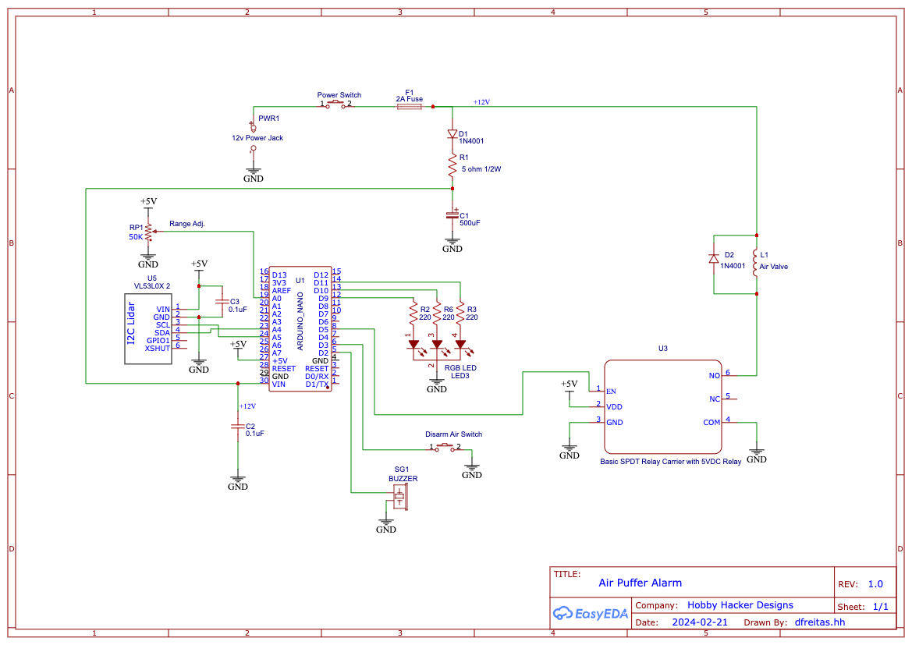

# AirPuffer

* Cat "stay-off-counter" airPuffer alarm.   Laser range finder detects cat.  Two distance zones defined: MEDIUM and NEAR.
If cat gets within MEDIUM, then a warning beep sounds.  If the cat gets within NEAR distance, a short puff of air is 
released from an air tank via an air valve.  

* There is an "armed/disarmed" LED to indicate when the air-puffer is active.  
Red flashing means air-puffer is enabled.  Green flashing means just the buzzer is active.  

* When the system is powered on, a "puff-counter" is initialized.  When MAX_PUFFS count is reached, the LED starts 
flashing blue to indicate you are out of air.  The buzzer will still function, just the air puffer will be disabled.
Note, if you power up with a partial air fill,  the count will not reflect your actual available air.

* The detection zone is controlled with a potentiometer that will adjust from 0mm to 1023mm.  This defines the MEDIUM zone.  
NEAR gets set to 50% of MEDIUM.

* Inspired by a project on Instructables at https://www.instructables.com/Pet-Deterrent-keep-them-away-from-those-off-limits/

## Parts List
- Arduino Nano
- 5V relay board
- VL53L0X laser range finder module ( https://www.amazon.com/gp/product/B08RRT1KJ6/ref=ppx_yo_dt_b_asin_title_o02_s00?ie=UTF8&th=1 )
- 12v air-valve  (Search Amazon for: Beduan 2 Way Normally Closed DC 12V Electric Solenoid Air Valve 1/4" NPT )
- RGB LED (four-pin common cathode)
- 5v continuous sounding Piezo-Buzzer
- 12v/1A wall-wart power supply
- Old CD storage case
- 50K potentiometer for range-control
- Common Resistors/Caps/Diodes/Switches
- 2" PVC with reducers to get to 1/4 NPT fittings for Schrader-filler-valve and air-valve

dlf  2/28/2024

## Schematics

# Build Pictures

## The air tank and circuit boards mounted in an old CD case... Not pretty, but it's just a prototype!

&nbsp;  
&nbsp;  
&nbsp;  

## Uses an Arduino Nano and relay board. 

&nbsp;  
&nbsp;  
&nbsp;  

## 2" PVC and NPT plumbing fittings with an air valve.  I'm only pressurizing tank to about 70lbs/sq-in  

&nbsp;  
&nbsp;  
&nbsp;  

## The old CD case re-purposed into an airPuffer alarm...  

&nbsp;  
&nbsp;  
&nbsp;  

## The business end of the alarm (laser ranger and air nozzle)  

